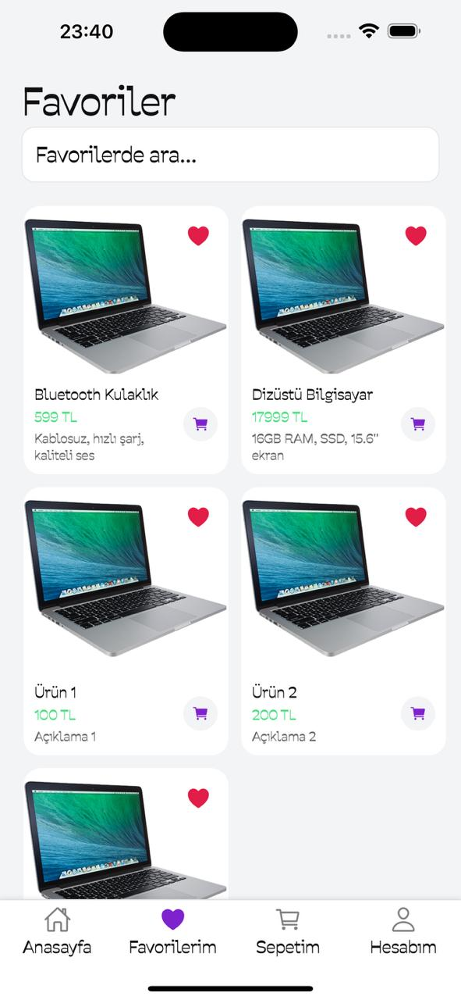

# Expo ProductList Uygulaması

Bu uygulama, Expo + React Native ile geliştirilmiş modern bir ürün listeleme ve alışveriş sepeti örneğidir. Kullanıcılar ürünleri görebilir, favorilere ekleyebilir, sepete ürün ekleyip çıkarabilir ve profil bilgilerini görüntüleyebilir.

## Özellikler
- **Ana Sayfa:** Popüler ürünler ve tüm ürünler listesi, arama çubuğu
- **Favoriler:** Favorilere eklenen ürünler, favorilerde arama
- **Sepet:** Sepete eklenen ürünler, adet arttır/azalt, toplam tutar
- **Profil:** Kullanıcı bilgileri, uygulama ve Türkçe klavye hakkında bilgilendirme
- **Custom Font:** Tüm metinler Labrada-Regular fontu ile gösterilir
- **Modern ve kullanıcı dostu arayüz**

## Kurulum
1. Depoyu klonlayın:
   ```sh
   git clone https://github.com/Cavga1903/expo-product-list.git
   cd expo-productList
   ```
2. Bağımlılıkları yükleyin:
   ```sh
   npm install
   # veya
   yarn install
   ```
3. Expo ile başlatın:
   ```sh
   npx expo start
   ```

## Kullanım
- Uygulama açıldığında ana sayfa gelir.
- Ürünleri favorilere ekleyebilir, sepete ekleyebilir ve arama yapabilirsiniz.
- Sepette ürün adedini arttırıp azaltabilir, toplam tutarı görebilirsiniz.
- Profil sekmesinde uygulama ve Türkçe klavye hakkında bilgi bulabilirsiniz.

## Ekran Görüntüleri
<p align="center">
  
  
  
  
</p>

## Katkı
Katkıda bulunmak için fork'layıp pull request gönderebilirsiniz.

## Lisans
MIT 